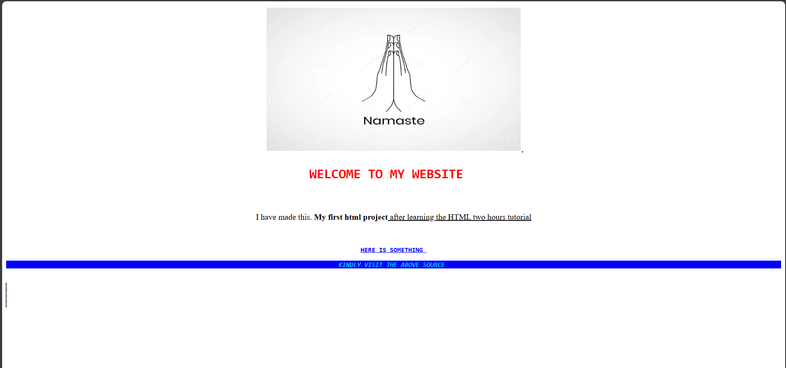
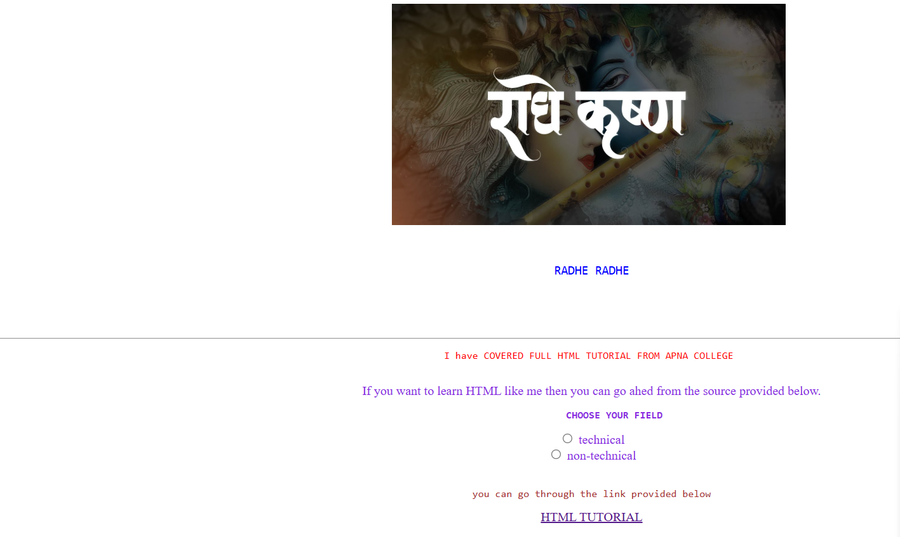

# HTML based project 

A simple and multi-page only HTML based website hosted on Github pages.
## 🔗 Live Website

Visit: [Live Website](https://ayush-singh-014.github.io/project2/)

## 📂 Files Included

- index.html –Home page
- xyz.html -second page
- Images – greeting , thanks and self info. images 
  
## ✨ Features

- Responsive design
- Clean layoutusing HTML
- Includes social links, navigation between pages, and basic info

## 🚀 How to Use

You can clone or download this repository and simply open index2.html in any browser.

bash
git clone https://github.com/Ayush-singh-014/project2.git

## 📸 Screenshots

### 🖼 Home Page

### 🖼 Second Page

## 🙋‍♂ Author

[Ayush Singh](https://github.com/ayush-singh-014)

